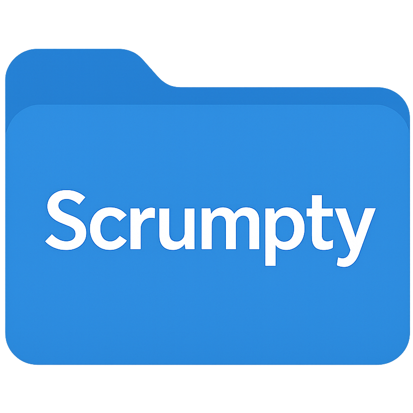

# 🚀 Scrumpty - Enterprise-Grade Agile Project Management

<div align="center">



**The Complete Solution for Agile Teams at Scale**

[](https://nextjs.org/)
[](https://www.typescriptlang.org/)
[](https://tailwindcss.com/)
[](https://appwrite.io/)
[](LICENSE)

*A powerful project management platform for modern agile teams: workspaces, spaces, projects, teams, sprints, work items, workflows, custom fields, time tracking, docs, and integrations.*

[📖 Documentation](#-documentation) | [🚀 Quick Start](#-quick-start) | [🐛 Report Bug](https://github.com/JaiVishalSingh/Scrumpty/issues) | [✨ Request Feature](https://github.com/JaiVishalSingh/Scrumpty/issues)

</div>

---

## 📚 Documentation

<div align="center">
  <table>
    <tr>
      <td align="center" width="25%">
        <a href="#-quick-start"><h3>🚀 Quick Start</h3></a>
        <p>Get up and running fast</p>
      </td>
      <td align="center" width="25%">
        <a href="./APPWRITE_GUIDE.md"><h3>📊 Appwrite Guide</h3></a>
        <p>Complete schema & setup</p>
      </td>
      <td align="center" width="25%">
        <a href="./CONTRIBUTING.md"><h3>🤝 Contributing</h3></a>
        <p>How to contribute</p>
      </td>
      <td align="center" width="25%">
        <a href="./CODE_OF_CONDUCT.md"><h3>📜 Code of Conduct</h3></a>
        <p>Community guidelines</p>
      </td>
    </tr>
  </table>
</div>

---

## ✨ Features

<div align="center">
  <table>
    <tr>
      <td align="center" width="33%">
        <h3>🏢 Multi-Workspace</h3>
        <p>Organize workspaces, spaces, programs, teams, and projects</p>
      </td>
      <td align="center" width="33%">
        <h3>📋 Work Items</h3>
        <p>Stories, Tasks, Bugs, Epics with custom fields & workflows</p>
      </td>
      <td align="center" width="33%">
        <h3>🏃 Sprints & Boards</h3>
        <p>Scrum, Kanban, or Hybrid with velocity and burndown</p>
      </td>
    </tr>
    <tr>
      <td align="center" width="33%">
        <h3>🔄 Custom Workflows</h3>
        <p>Status flows, transitions, and rules per workspace/space/project</p>
      </td>
      <td align="center" width="33%">
        <h3>⏱️ Time Tracking</h3>
        <p>Estimates vs actuals, timesheets, capacity insights</p>
      </td>
      <td align="center" width="33%">
        <h3>📎 Files & Docs</h3>
        <p>Attachments (50MB) and project docs (5GB) with previews</p>
      </td>
    </tr>
    <tr>
      <td align="center" width="33%">
        <h3>💬 Collaboration</h3>
        <p>Threaded comments, @mentions, notifications</p>
      </td>
      <td align="center" width="33%">
        <h3>🐙 GitHub Integration</h3>
        <p>Repo links, commit sync, AI docs, code Q&A</p>
      </td>
      <td align="center" width="33%">
        <h3>📊 Analytics</h3>
        <p>Burndown, velocity, team performance, timelines</p>
      </td>
    </tr>
  </table>
</div>

---

## 🌟 Why Scrumpty?

- **Enterprise-ready**: Multi-workspace, programs, teams, permissions.
- **Flexible workflows**: Workspace/space/project-level customization.
- **Custom fields**: Text, numbers, selects, users, dates, currency, labels.
- **Built-in time tracking**: Estimates vs actuals, timesheets, exports.
- **Integration-ready**: GitHub, notifications, storage.
- **Self-host friendly**: Appwrite backend; full data ownership.
- **Modern stack**: Next.js 14, TypeScript, Tailwind, Appwrite.

---

## 🛠️ Tech Stack

**Frontend**: Next.js 14 (App Router, RSC), TypeScript, Tailwind CSS, Radix UI, shadcn/ui, Lucide, React Hook Form, Zod, TanStack Query, React Big Calendar, Recharts, Next Themes, Sonner.

**Backend**: Appwrite (Auth, DB, Storage, Functions, Realtime), Hono for API routes, Next.js Server Actions.

**Tooling**: ESLint, Prettier, TypeScript strict mode, Git.

---

## 🚀 Quick Start

### Prerequisites
- Node.js 18+ (npm/yarn/pnpm/bun)
- Appwrite Cloud or self-hosted Appwrite

### Install
```bash
git clone https://github.com/JaiVishalSingh/Scrumpty.git
cd Scrumpty
npm install  # or bun install
```

### Configure env
Create `.env.local` with your values:
```env
NEXT_PUBLIC_APP_URL=http://localhost:3000
NEXT_PUBLIC_APPWRITE_ENDPOINT=https://cloud.appwrite.io/v1
NEXT_PUBLIC_APPWRITE_PROJECT=your_project_id
NEXT_APPWRITE_KEY=your_api_key
NEXT_PUBLIC_APPWRITE_DATABASE_ID=your_database_id
NEXT_PUBLIC_APPWRITE_WORKSPACES_ID=workspaces
NEXT_PUBLIC_APPWRITE_MEMBERS_ID=members
NEXT_PUBLIC_APPWRITE_PROJECTS_ID=projects
NEXT_PUBLIC_APPWRITE_TASKS_ID=tasks
NEXT_PUBLIC_APPWRITE_SPRINTS_ID=sprints
NEXT_PUBLIC_APPWRITE_WORK_ITEMS_ID=work_items
NEXT_PUBLIC_APPWRITE_TIME_LOGS_ID=time_logs
NEXT_PUBLIC_APPWRITE_PERSONAL_BACKLOG_ID=personal_backlog
NEXT_PUBLIC_APPWRITE_CUSTOM_COLUMNS_ID=custom_columns
NEXT_PUBLIC_APPWRITE_DEFAULT_COLUMN_SETTINGS_ID=default_column_settings
NEXT_PUBLIC_APPWRITE_NOTIFICATIONS_ID=notifications
NEXT_PUBLIC_APPWRITE_SUBTASKS_ID=subtasks
NEXT_PUBLIC_APPWRITE_ATTACHMENTS_ID=attachments
NEXT_PUBLIC_APPWRITE_COMMENTS_ID=comments
NEXT_PUBLIC_APPWRITE_GITHUB_REPOS_ID=github_repos
NEXT_PUBLIC_APPWRITE_CODE_DOCS_ID=code_docs
NEXT_PUBLIC_APPWRITE_PROJECT_DOCS_ID=project_docs
NEXT_PUBLIC_APPWRITE_TEAMS_ID=teams
NEXT_PUBLIC_APPWRITE_TEAM_MEMBERS_ID=team_members
NEXT_PUBLIC_APPWRITE_PROGRAMS_ID=programs
NEXT_PUBLIC_APPWRITE_CUSTOM_ROLES_ID=custom_roles
NEXT_PUBLIC_APPWRITE_SPACES_ID=spaces
NEXT_PUBLIC_APPWRITE_SPACE_MEMBERS_ID=space_members
NEXT_PUBLIC_APPWRITE_WORKFLOWS_ID=workflows
NEXT_PUBLIC_APPWRITE_WORKFLOW_STATUSES_ID=workflow_statuses
NEXT_PUBLIC_APPWRITE_WORKFLOW_TRANSITIONS_ID=workflow_transitions
NEXT_PUBLIC_APPWRITE_IMAGES_BUCKET_ID=images
NEXT_PUBLIC_APPWRITE_ATTACHMENTS_BUCKET_ID=attachments_bucket
NEXT_PUBLIC_APPWRITE_PROJECT_DOCS_BUCKET_ID=project-docs
NEXT_PUBLIC_APPWRITE_SMTP_PROVIDER_ID=your_smtp_provider_id
NEXT_PUBLIC_APPWRITE_EMAIL_TOPIC_ID=your_email_topic_id
```

> Full schema and bucket details: see [APPWRITE_GUIDE.md](./APPWRITE_GUIDE.md).

### Run
```bash
npm run dev   # or bun dev
# open http://localhost:3000
```

---

## 📁 Project Structure

```
Scrumpty/
├── public/                # Static assets
├── docs/                  # Documentation
├── src/
│   ├── app/               # Next.js App Router (auth, dashboard, api, oauth)
│   ├── components/        # UI & shared components
│   ├── features/          # Feature modules (workspaces, spaces, projects, tasks,
│   │                      # sprints, teams, programs, workflows, custom-fields,
│   │                      # time-tracking, comments, attachments, notifications,
│   │                      # github-integration, project-docs, personal-backlog,
│   │                      # subtasks, work-item-links, timeline, saved-views, audit-logs)
│   ├── hooks/             # Reusable hooks
│   ├── lib/               # Appwrite client, RPC, utils, session middleware
│   ├── types/             # Shared types
│   └── config.ts          # Environment config constants
├── CODE_OF_CONDUCT.md
├── CONTRIBUTING.md
├── APPWRITE_GUIDE.md
├── components.json
├── tailwind.config.ts
├── next.config.mjs
├── tsconfig.json
└── package.json
```

---

## 🎯 Core Features (Detail)

- **Organization**: Workspaces → Spaces → Projects; Programs and Teams with custom roles/permissions.
- **Boards**: Scrum, Kanban, Hybrid; WIP limits; swimlanes; sprint metrics.
- **Workflows**: Custom statuses and transitions per scope; rules, allowed roles, auto-assign.
- **Work Items**: Stories/Tasks/Bugs/Epics/Subtasks; labels; components; relationships (blocks, relates, duplicates, split, clone, parent/child, causes).
- **Custom Fields**: Text, number, date/time, select/multi-select, user(s), checkbox, URL, email, currency, percentage, labels; scope to workspace/space/project.
- **Time Tracking**: Estimates vs actuals; per-user timesheets; capacity/velocity; exports.
- **Docs & Files**: Attachments up to 50MB; project docs up to 5GB with categories (PRD/FRD/spec/etc.).
- **Comments**: Threaded, @mentions, edit flag, reply chains.
- **Notifications**: Assignments, status/priority/due changes, comments, attachments.
- **GitHub Integration**: Repo links, commit sync, generated docs, Q&A.
- **Timeline & Calendar**: Gantt-style timelines, calendar for due dates/milestones.
- **Analytics**: Burndown, velocity, workload, project progress, risk signals.
- **Security**: RBAC, space visibility, file validation, email verification.

---

## 🔧 Development

**Scripts**
```bash
npm run dev      # dev server
npm run build    # production build
npm run start    # start production
npm run lint     # lint
```

**Guidelines**
- TypeScript strict; explicit types.
- Prefer Server Components; use client components only when needed.
- Use Tailwind utilities and shadcn/ui primitives.
- Validate inputs with Zod; keep components small and composable.
- Run lint before pushing.

**Example**
```typescript
export async function getWorkspaceById(workspaceId: string) {
  const { databases } = await createSessionClient();
  return databases.getDocument(DATABASE_ID, WORKSPACES_ID, workspaceId);
}
```

---

## 🚀 Deployment

**Vercel (recommended)**
[](https://vercel.com/new/clone?repository-url=https://github.com/JaiVishalSingh/Scrumpty)

1) Import repo to Vercel
2) Set env vars (see `.env.local`)
3) Deploy

**Docker (example)**
```dockerfile
FROM node:18-alpine
WORKDIR /app
COPY package*.json ./
RUN npm install
COPY . .
RUN npm run build
EXPOSE 3000
CMD ["npm", "start"]
```

---

## 🗺️ Roadmap

**Completed**: Multi-workspace, Scrum/Kanban/Hybrid boards, custom workflows, custom fields, time tracking, teams/programs, work item links, GitHub integration, comments/attachments, notifications, timelines, analytics.

**In Progress**: Advanced reporting dashboard, automation rules, webhooks, mobile app.

**Planned**: Jira import/export, Slack/Discord/Teams integration, approvals, capacity planning, portfolio mgmt, AI insights, custom widgets, i18n, advanced search, bulk ops, 2FA.

---

## 📊 Database Snapshot

- **Collections**: 26 (workspaces, spaces, space_members, programs, teams, team_members, custom_roles, projects, members, tasks, work_items, sprints, workflows, workflow_statuses, workflow_transitions, custom_columns, default_column_settings, time_logs, subtasks, comments, attachments, notifications, personal_backlog, github_repos, code_docs, project_docs)
- **Buckets**: 3 (images, attachments_bucket, project-docs)

Full attribute list, types, required flags, lengths, and indexes: see [APPWRITE_GUIDE.md](./APPWRITE_GUIDE.md).

---

## 🔐 Security

- Email verification required (configure SMTP provider & topic in Appwrite).
- RBAC via workspace/member roles and custom team roles.
- Data encrypted at rest/in transit; secure sessions.
- File validation on uploads; antivirus enabled on buckets (Appwrite settings).
- Report vulnerabilities privately (not via public issues).

---

## 🙏 Acknowledgments

- [Vercel](https://vercel.com)
- [Appwrite](https://appwrite.io)
- [Radix UI](https://www.radix-ui.com)
- [shadcn/ui](https://ui.shadcn.com)
- [Tailwind CSS](https://tailwindcss.com)
- [TanStack Query](https://tanstack.com/query)
- [Hono](https://hono.dev)

## 💬 Community & Support
- Docs: [APPWRITE_GUIDE.md](./APPWRITE_GUIDE.md)
- Issues: [Bugs](https://github.com/JaiVishalSingh/Scrumpty/issues/new?labels=bug) | [Features](https://github.com/JaiVishalSingh/Scrumpty/issues/new?labels=enhancement)
- Discussions: [GitHub Discussions](https://github.com/JaiVishalSingh/Scrumpty/discussions)
- Contact: support@scrumpty.com

<div align="center">

**Built with ❤️ for Agile Teams** — ⭐ us if this helps!

</div>
